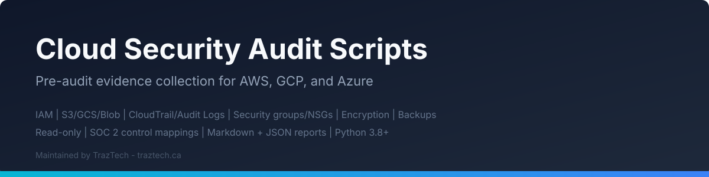

<p align="center">
  
</p>

# Cloud Security Audit Scripts

**Pre-audit evidence collection and security assessment scripts for AWS, GCP, and Azure.**

## Demo

<p align="center">
  
</p>

Maintained by [TrazTech](https://traztech.ca): a security and compliance consultancy based in Toronto, specializing in cloud security reviews (AWS, GCP, Azure) and SOC 2 / ISO 27001 readiness engagements. Led by [Jacob Masse](https://jacobmasse.com), whose vulnerability research includes 5 CVEs (notably [CVE-2024-45163](https://nvd.nist.gov/vuln/detail/CVE-2024-45163), CVSS 9.1).

---

## What This Is

A collection of **lightweight, read-only** scripts that gather cloud security posture evidence across AWS, GCP, and Azure. Each script interrogates your cloud environment for common misconfigurations and produces a structured markdown or JSON report you can hand to auditors, attach to compliance evidence folders, or use to prioritize remediation.

These scripts perform **no modifications** to your environment. Every API call is read-only.

The checks are aligned with the key categories from the [TrazTech Cloud Security Posture Check](https://traztech.ca/tools/cloud-security-posture-check): IAM, Logging, Encryption, Network, Backups, Secrets Management, Security Posture, and Governance.

## Who This Is For

- Engineering and DevOps teams preparing for **SOC 2 Type II** audits
- Organizations pursuing **ISO 27001** certification
- Security teams running internal cloud security reviews
- Anyone who wants a quick snapshot of their cloud security posture

If you need a full assessment or help interpreting results, see [TrazTech consulting services](https://traztech.ca) or start with the free [Cloud Security Posture Check](https://traztech.ca/tools/cloud-security-posture-check).

## Prerequisites

| Tool | Version | Purpose |
|------|---------|---------|
| Python | 3.8+ | Script runtime |
| AWS CLI | v2 | AWS credential resolution and some checks |
| gcloud CLI | latest | GCP authentication and project context |
| Azure CLI | latest | Azure authentication and subscription context |
| jq | 1.6+ | Optional: JSON output formatting |

Install Python dependencies:

```bash
pip install -r requirements.txt
```

### Authentication

Each provider script expects you to be authenticated via the standard CLI mechanism:

- **AWS**: `aws configure` or environment variables (`AWS_ACCESS_KEY_ID`, `AWS_SECRET_ACCESS_KEY`)
- **GCP**: `gcloud auth application-default login` and `gcloud config set project <PROJECT_ID>`
- **Azure**: `az login` and `az account set --subscription <SUB_ID>`

**Recommended IAM permissions**: Read-only / Viewer / SecurityAudit policies. See each provider directory for specifics.

## Quick Start

### AWS

> **Note:** AWS audits run against the configured region. For multi-region environments, run the script once per region or use `--region` to target specific regions.

```bash
# Full AWS audit
python aws/aws_audit.py --profile production --output-format markdown --output-dir reports/

# IAM-only audit
python aws/aws_iam_report.py --profile production

# S3-only audit
python aws/aws_s3_audit.py --profile production
```

### GCP

```bash
# Full GCP audit
python gcp/gcp_audit.py --project my-project-id --output-format markdown --output-dir reports/
```

### Azure

> **Note:** Azure Entra ID (AAD) checks require the Azure CLI (`az`) to be installed and authenticated (`az login`), not just the Python SDK. The script shells out to `az ad` commands for Entra ID user enumeration and guest user checks.

```bash
# Full Azure audit
python azure/azure_audit.py --subscription <sub-id> --output-format markdown --output-dir reports/
```

## Output Format

Reports are generated as **Markdown** (default) or **JSON**. Each finding includes:

| Field | Description |
|-------|-------------|
| **Severity** | CRITICAL, HIGH, MEDIUM, LOW, INFO |
| **Category** | IAM, Logging, Encryption, Network, Backups, Secrets, Posture, Governance |
| **Check** | What was evaluated |
| **Status** | PASS, FAIL, WARNING, ERROR |
| **Details** | Human-readable explanation |
| **Resource** | The specific resource identifier |
| **SOC 2 Mapping** | Applicable SOC 2 Trust Services Criteria (e.g., CC6.1) |

Example snippet from a report:

```
## IAM Findings

| Severity | Check | Status | Resource | SOC 2 |
|----------|-------|--------|----------|-------|
| CRITICAL | Root account MFA | FAIL | arn:aws:iam::123456789012:root | CC6.1 |
| HIGH | Password policy complexity | FAIL | Account password policy | CC6.1 |
| MEDIUM | Unused credentials (90+ days) | WARNING | user/old-service-account | CC6.2 |
```

## Compliance Mapping

Findings are mapped to **SOC 2 Trust Services Criteria** (2017) so you can cross-reference with your auditor:

| SOC 2 Criteria | Description | Script Checks |
|----------------|-------------|---------------|
| **CC6.1** | Logical access security | IAM policies, MFA, password policy, access keys |
| **CC6.2** | Access provisioning/deprovisioning | Unused credentials, stale accounts, access key rotation |
| **CC6.3** | Role-based access | Overly permissive policies, least privilege |
| **CC6.6** | System boundaries | Security groups, firewall rules, NSGs, network segmentation |
| **CC6.7** | Data transmission security | Encryption in transit, TLS enforcement, secure transfer |
| **CC6.8** | Malicious software prevention | Not yet implemented (GuardDuty, Security Hub planned) |
| **CC7.1** | Detection mechanisms | CloudTrail, audit logs, activity logs, monitoring |
| **CC7.2** | Monitoring activities | CloudWatch alarms, log sinks, diagnostic settings |
| **CC8.1** | Change management | AWS Config, change tracking |
| **A1.2** | Recovery mechanisms | Backups, versioning, multi-AZ, replication |

For a complete SOC 2 readiness walkthrough, see the [TrazTech SOC 2 Readiness Checklist](https://traztech.ca/soc-2-readiness-checklist).

## Repository Structure

```
cloud-security-audit-scripts/
├── README.md
├── LICENSE                    # Apache 2.0
├── requirements.txt
├── .gitignore
├── aws/
│   ├── aws_audit.py           # Full AWS security audit
│   ├── aws_iam_report.py      # IAM-focused audit
│   └── aws_s3_audit.py        # S3-focused audit
├── gcp/
│   └── gcp_audit.py           # Full GCP security audit
├── azure/
│   └── azure_audit.py         # Full Azure security audit
├── reports/
│   ├── report_template.md     # Jinja2 report template
│   └── sample_report.md       # Example output
└── utils/
    ├── __init__.py
    └── common.py              # Shared utilities
```

## Permissions Note

All scripts perform **read-only** operations. No resources are created, modified, or deleted. Recommended policies:

- **AWS**: `arn:aws:iam::aws:policy/SecurityAudit` or `ReadOnlyAccess`
- **GCP**: `roles/viewer` and `roles/iam.securityReviewer`
- **Azure**: `Reader` role at subscription scope

## Disclaimer

These scripts are provided as-is for evidence collection and preliminary assessment. They do not constitute a formal audit or certification. Results should be reviewed by qualified security professionals. For professional cloud security assessments, SOC 2 readiness engagements, or ISO 27001 preparation, contact [TrazTech](https://traztech.ca).

## Resources

- [TrazTech Cloud Security Posture Check](https://traztech.ca/tools/cloud-security-posture-check): Free automated assessment
- [TrazTech SOC 2 Readiness Checklist](https://traztech.ca/soc-2-readiness-checklist): Step-by-step preparation guide
- [TrazTech Blog](https://traztech.ca/blog): 100+ articles on cloud security and compliance
- [TrazTech Consulting](https://traztech.ca): Professional security and compliance services

## License

Apache 2.0. See [LICENSE](LICENSE).
